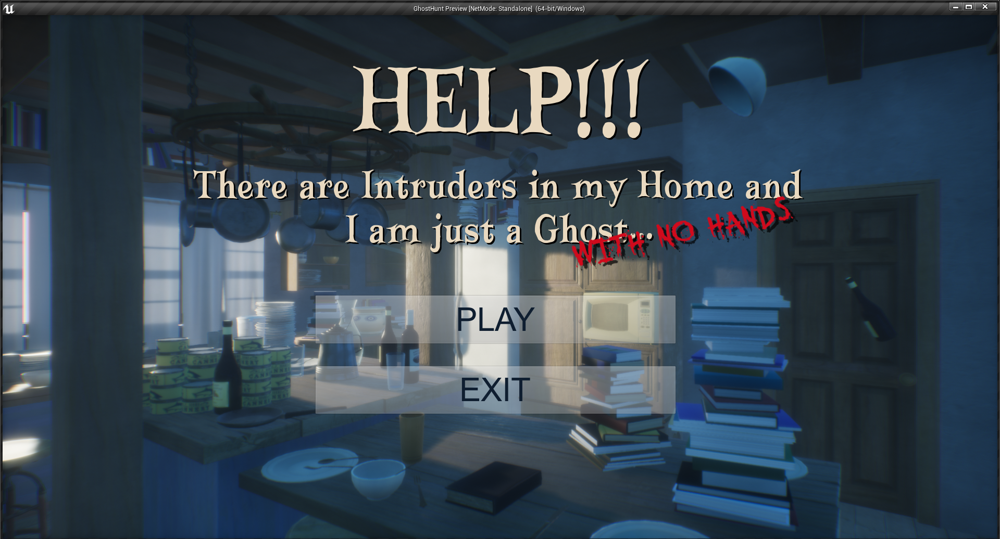
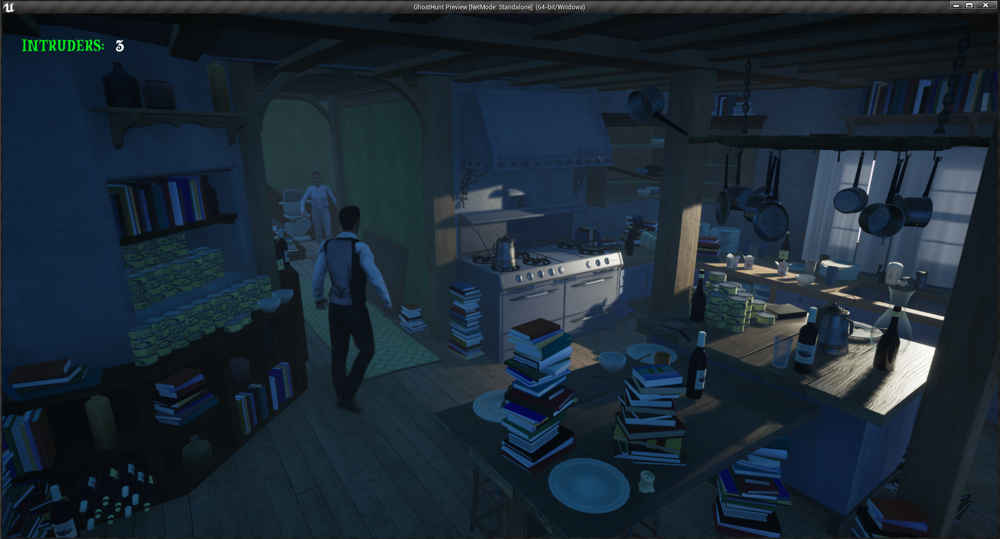
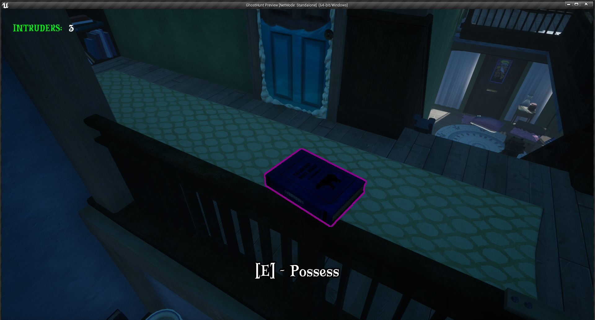
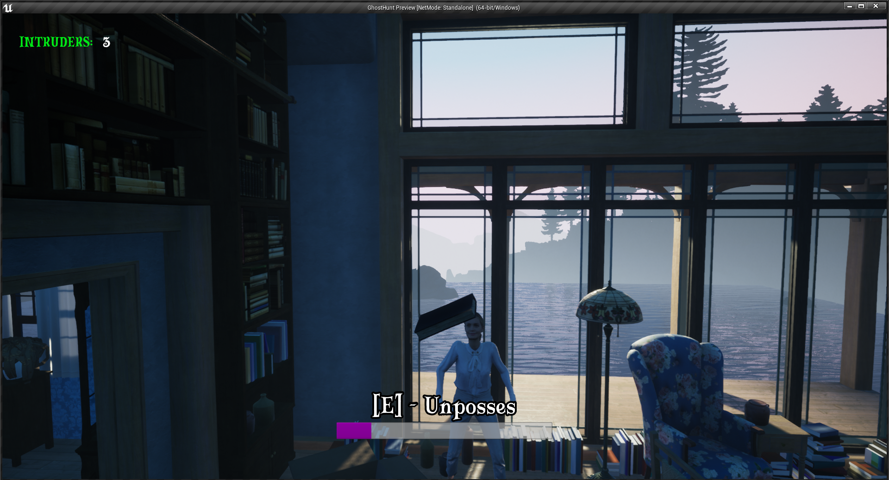

# GhostHunt

People are intruding your home and you are a ghost!  
Scare them away by possessing objects or make scary sounds with them.

WASD - Move around  
Space - Move up  
Shift - Move down  
E - Use objects  

Developed in 48h (+ some polishing :see_no_evil:)

[**Click here to download from GitHub**](https://github.com/Frechfuchs/GhostHunt/releases/download/v1.0.0/GhostHunt.zip)
[**Click here to download from Google Drive**](https://drive.google.com/file/d/1wcUxkr8xYOyLkPeBf4hythX1LSolnUEd/view?usp=sharing)
..or download the project and run it in UE4 yourself :)

Developed with Unreal Engine 4
